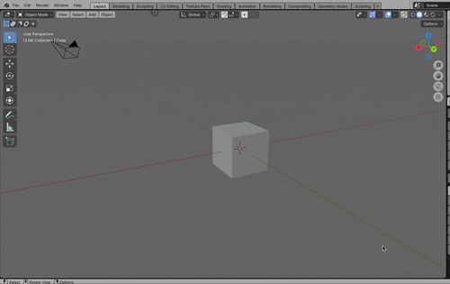
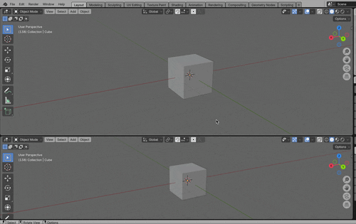

### 3D Viewport とは

- Blender　で基本的に使うオブジェクトの編集画面

    

---

### エリア (= 画面) の分割

- #### 方法1

    - エリアの端にマウスカーソルを持っていくと、`↕︎` や `↔︎` カーソルに変化する

        - 上記の状態で `右クリック` をすると、エリアの分割 (&結合) の選択肢が表示される

            - Vertical Split: エリアを垂直に分割する

            - Horizaontal Split: エリアを水平に分割する

         

    

 
 

- #### 方法2

    - エリアの隅にマウスカーソルを持っていくと `+` カーソルに変化する

        - `左クリック` + `垂直方向へマウスをドラッグ` = エリアを垂直方向に分割

        - `左クリック` + `水平方向へマウスをドラッグ` = エリアを水平方向に分割

         

        

 
 

参考サイト

[【Blender】エリアの分割・結合](https://saru-blender.com/bunkatsu)

---

### エリアの結合

- #### 方法1

    - 分割されたエリアの端にマウスカーソルを持っていくと、`↕︎` や `↔︎` カーソルに変化する

        - 上記の状態で `右クリック` をすると、エリアの結合 (&分割) の選択肢が表示される

            - Join Right (Left): 画面右 (左)　をエリアを結合する

            - Join Down (Up): 画面下 (上) のエリアを結合する

         
    
    

 

- #### 方法2

    - 分割されたエリアの隅にマウスカーソルを持っていくと `+` カーソルに変化する

        - `左クリック` + `垂直方向へマウスをドラッグ` = エリアを垂直方向に分割

        - `左クリック` + `水平方向へマウスをドラッグ` = エリアを水平方向に分割

         

    

 
 

参考サイト

[【Blender】エリアの分割・結合](https://saru-blender.com/bunkatsu)

---

### エリアの4分割

- ★★★3D Viewportのみで有効

- `ctrl` + `option` + `q` で 3D Viewport を 4分割することができる

    - 元に戻したい場合はもう一度 `ctrl` + `option` + `q`

 

 
 

参考サイト

[【Blender】エリアの分割・結合](https://saru-blender.com/bunkatsu)

---

### エリアの交換

- #### 方法1

    - 分割されたエリアの端にマウスカーソルを持っていくと、`↕︎` や `↔︎` カーソルに変化する

        - 上記の状態で `右クリック` をすると、エリアの交換の選択肢 (Swap Areas) が表示される

         

    

 
 

- #### 方法2

    - 分割されたエリアの隅にマウスカーソルを持っていくと `+` カーソルに変化する

        - 上記の状態で `ctrl` + `左クリック` でエリアの交換ができる

         

    

 
 

参考サイト

[【Blender】エリアの分割・結合](https://saru-blender.com/bunkatsu)

---

### エリア分割/結合/交換のキャンセル

- ★エリアの分割/結合/交換をし終わった後はキャンセルできない

    - ★上記**操作中**の状態でのみキャンセルが可能

 

- エリアの 分割/結合/交換 中に `右クリック` で操作のキャンセルができる

 

 
 

参考サイト

[【Blender】エリアの分割・結合](https://saru-blender.com/bunkatsu)
