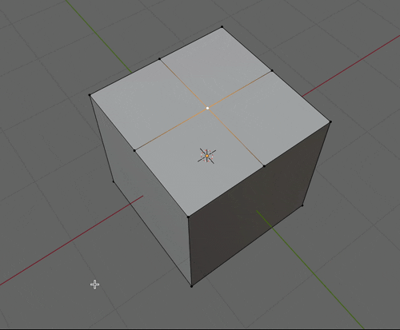
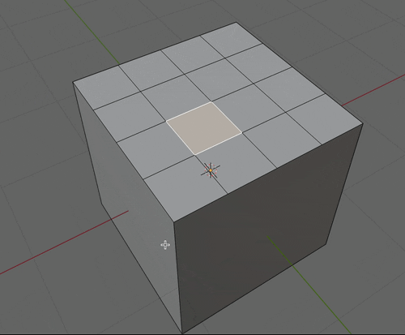
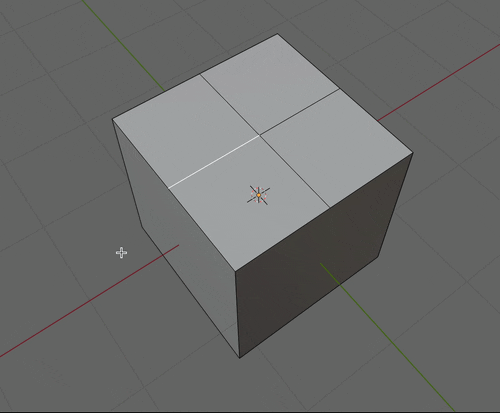
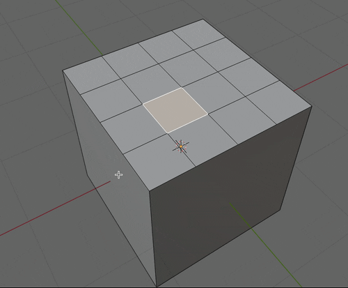
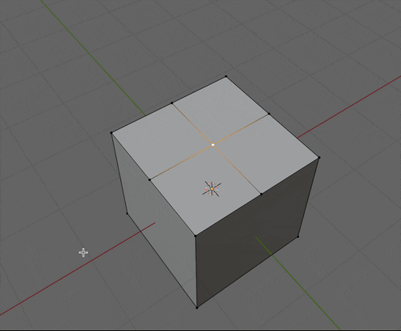
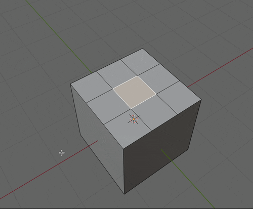
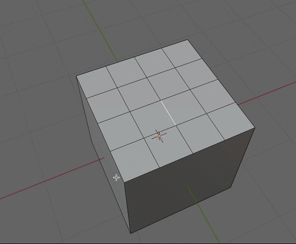
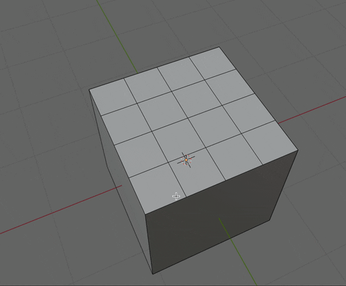
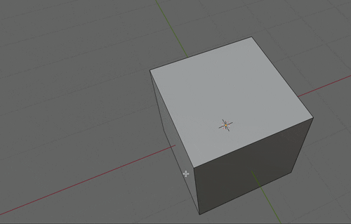
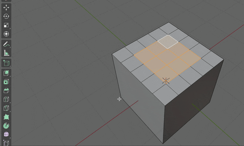

### 削除と溶解

#### ポイント

- Edit Mode で頂点/辺/面を選択した状態で `x` を押すと削除/溶解メニューが表示される

---

### 削除 (Delete)

- その名の通り、選択した頂点/辺/面を削除する機能

 

- #### 頂点の削除

    - 選択した頂点と**その頂点に接している辺と面**を削除する

    

     

    - 面を選択し、頂点の削除を行うと**選択した面の頂点の接する辺と面も削除する**

    

 
 

- #### 辺の削除

    - 選択した頂点と**その辺に接している面**を削除する

    

     

    - 面を選択し、辺の削除を行うと**選択した面の辺に接する他の面も削除する**

    

 
 

- #### 面の削除

    - 選択した面を削除する

    

 
 

- #### 辺と面のみ削除

    - 多分あまり使わないのでスルー

 
 

- #### 面のみ削除

    - 選択した面は消えるが、**辺は残す**

    

 
 

参考サイト

[【Blender】削除・溶解の違い](https://saru-blender.com/delete)

---

### 削除 (Dissolve)

- 選択した頂点/辺/面を溶かすイメージ

 

- #### 頂点の溶解

    - 選択した頂点と**その頂点に接している辺**を溶かす

    

     

    - 面を選択し、頂点の溶解を行うと**選択した面の頂点の接する辺も溶解する**

    

 
 

- #### 辺の溶解

    - 選択した辺と**その辺に接している頂点**を溶かす

    

 
 

- 面の溶解

    - 選択した面を溶かして一つの面にするイメージ

    - ★隣り合っていないとうまくいかない

    

 
 

参考サイト

[【Blender】削除・溶解の違い](https://saru-blender.com/delete)

---

### 注意点

- #### 溶解した面は subdivide できない

    

     

    - ナイフで切り分けることで subdivide と同じ結果にすることはできる

    