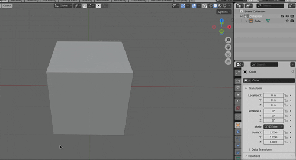
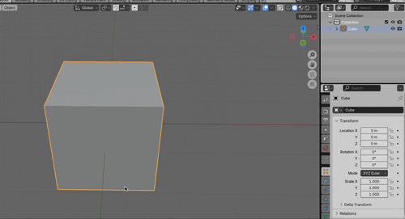

### 複製 (Duplicate)

- ★オブジェクト、メッシュを複製する機能

 

- Edit Mode, Object Mode の両方で利用できる

    - ★ただし、微妙に異なる挙動なので注意

 

- ★`shift` + `d` で複製 ON

 
 

- #### Edit Mode での複製

    - 対象のメッシュを複製する

    - ★複製したメッシュは複製元のオブジェクトに属する

        

 
 

- #### Object Mode での複製

    - 対象のオブジェクトを複製する

    - ★複製したオブジェクトは複製元のオブジェクトとは独立したものになる

        

 
 

参考サイト

[Blenderの機能「クリース」と「オブジェクトの複製方法」を見てみよう](https://gihyo.jp/article/2023/07/blender-basics-14#:~:text=オブジェクトモードにおける複製,-まずは、「%E2%81%A0オブジェクト&text=複製させたいオブジェクトを,動かせる状態になります%E3%80%82)