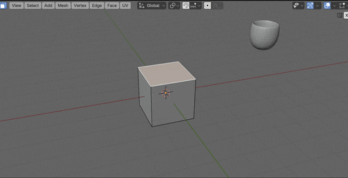
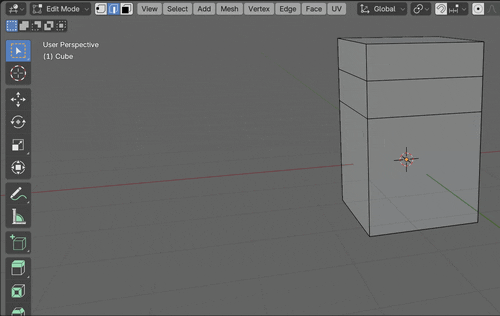
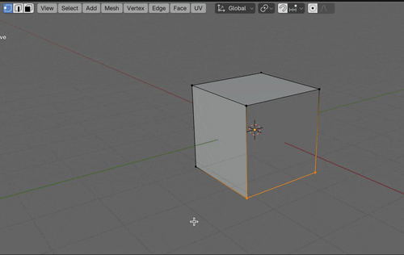
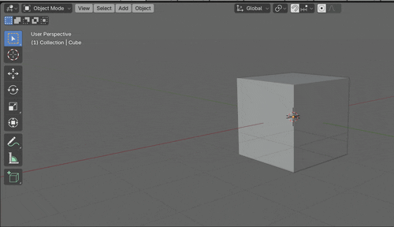

### 押し出し (Extrude)

- 押し出し (Extrude) とは、頂点・辺・面を押し出す事ができる機能のこと

    - イメージ的には引っ張ったり、押し込んだりする感じ

 

- #### 面の押し出し

    - 前提条件: Edit Mode にて面の編集モードで面を選択

    - 方法1: `左クリック` → `Extrude Faces` を選択

    - 方法2: `e` (ショートカットキー)

    - 方法3: 左のメニューバーにある `Extrude Region` を選択

    

 

- #### 辺の押し出し

    - 前提条件: Edit Mode にて辺の編集モードで辺を選択

    - 方法1: `左クリック` → `Extrude Edges` を選択

    - 方法2: `e` (ショートカットキー)

    - 方法3: 左のメニューバーにある `Extrude Region` を選択

    

 

- #### 頂点の押し出し

    - 前提条件: Edit Mode にて頂点の編集モードで頂点を選択

    - 方法1: `左クリック` → `Extrude Vertices` を選択

    - 方法2: `e` (ショートカットキー)

    - 方法3: 左のメニューバーにある `Extrude Region` を選択

    

 
 

参考サイト

[【Blender】押し出し・面の差し込み](https://saru-blender.com/extrude)

---

### 差し込み (Inset)

- 面の差し込みとは選択した面の内側に新しい面を差し込む機能

- ★差し込みは面にしかできない

- #### 面の差し込み方法

    - 前提: Edit Mode にて面の編集モードで面を選択

    - 方法1: `左クリック` → `Inset Faces` を選択

    - 方法2: `i` (ショートカットキー)

    - 方法3: 左のメニューバーにある `Inset Faces` を選択

    