### Knife

- メッシュに切り込みを入れることのできるツール

    - 切り込みは辺になる

 
 

- #### ★Edit Mode 上で　 `k` でナイフ機能 ON

    - ナイフ機能が ON になるとマウスポインターがナイフになる

        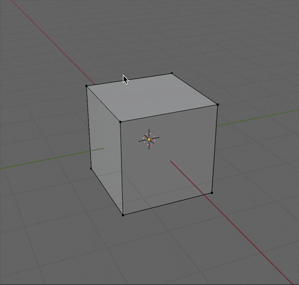

 
 

- #### `左クリック` + `マウスドラッグ` でオブジェクトに切り込みを入れる

    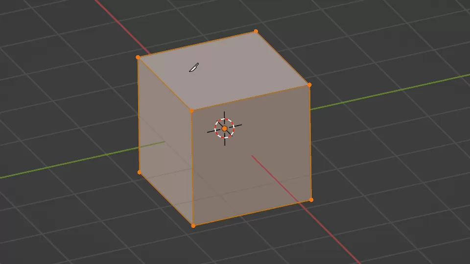

    引用: [【Blender】ナイフ・ナイフ投影の使い方](https://saru-blender.com/knife)

 
 

- #### `ctrl` + `z` で切り込みを一つ前の状態に戻す

    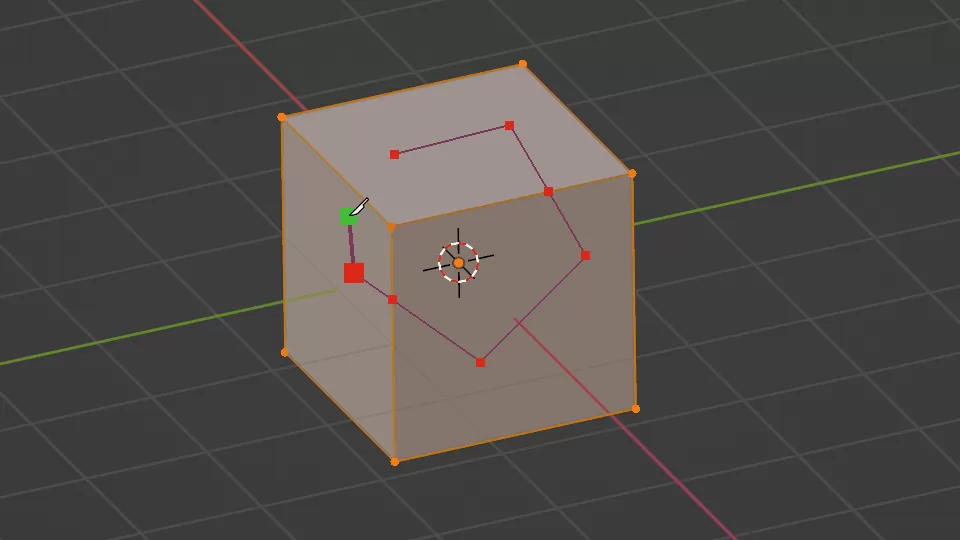

    引用: [【Blender】ナイフ・ナイフ投影の使い方](https://saru-blender.com/knife)

 
 

- #### `右クリック` で新しくナイフで切り込みを入れる

    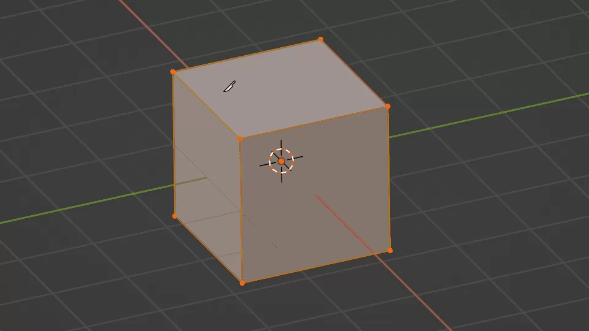

    引用: [【Blender】ナイフ・ナイフ投影の使い方](https://saru-blender.com/knife)

 
 

- #### `space` または `enter`　で現在の切れ込みを確定する

    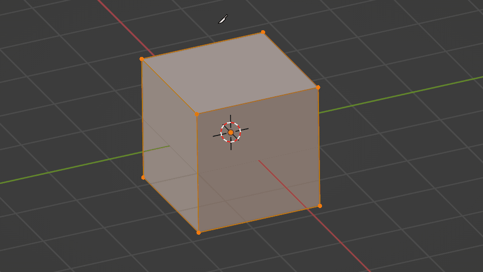

    引用: [【Blender】ナイフ・ナイフ投影の使い方](https://saru-blender.com/knife)

 
 

- #### ★`esc` でナイフ機能を中止する

    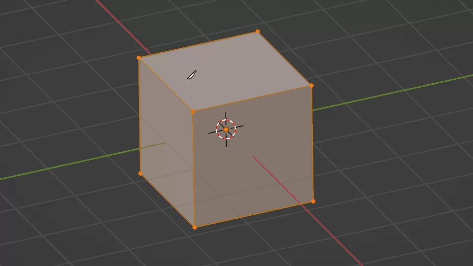

    引用: [【Blender】ナイフ・ナイフ投影の使い方](https://saru-blender.com/knife)

 
 

- #### `c` を押しながら切ると、貫通して切り込むことができる

    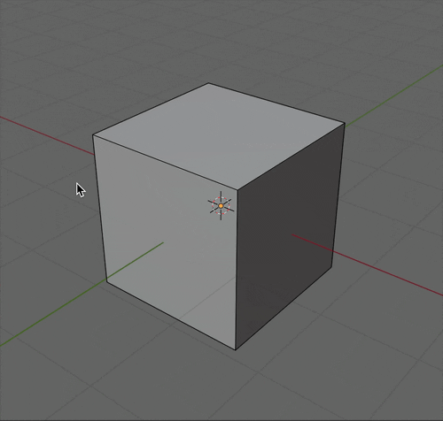

 
 

- #### `shift` を押しながら操作すると、辺の中心にスナップされる

    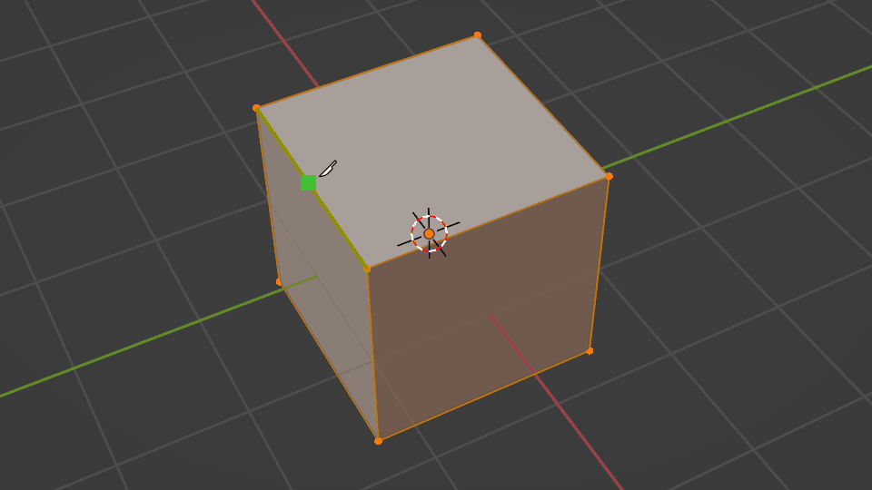

    引用: [【Blender】ナイフ・ナイフ投影の使い方](https://saru-blender.com/knife)

 
 

- #### 操作中に　`x`, `y`, `z` を押すことでその軸の方向に操作が限定される

    - `shift` + `x` で x 軸**以外の方向**に操作が限定される (shift + y/z も同様)

    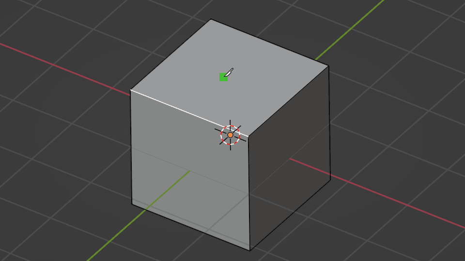

    引用: [【Blender】ナイフ・ナイフ投影の使い方](https://saru-blender.com/knife)

 
 

- #### `a` で操作の角度を固定することができる

    

    引用: [【Blender】ナイフ・ナイフ投影の使い方](https://saru-blender.com/knife)

     

    - ★★`a` を押した後に任意の数字を入力することで、その入力した角度に固定することができる

---

### 二等分 (Bisect)

- ナイフで切った後に細かい操作ができる機能

 

- #### 二等分を使うには、ツールバーのナイフ項目を `左クリック長押し` で切り替える

    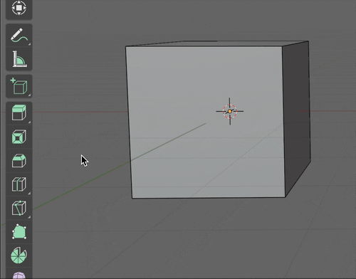

 
 

- #### ★普通のナイフと異なり、切り込み対象の辺/面を選択していないと二等分できない

    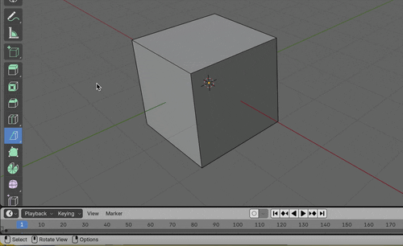

 
 

- #### 対象オブジェクトの全ての辺/面を選択した状態で2等分すると、 普通のナイフで [`c` を押した貫通カット](#c-を押しながら切ると貫通して切り込むことができる)と同じことができる

    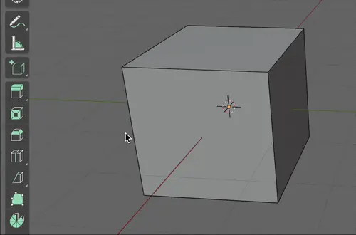

 
 

#### 二等分特有の操作

- 二等分した後、エリアに丸と矢印及び設定項目が表示される

    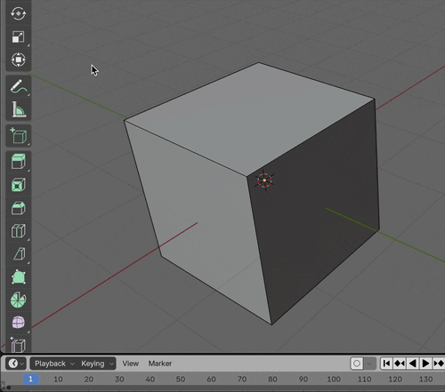

 
 

- #### 丸を`左クリックでドラッグ`することで、切り込みの**角度**を変更することができる

    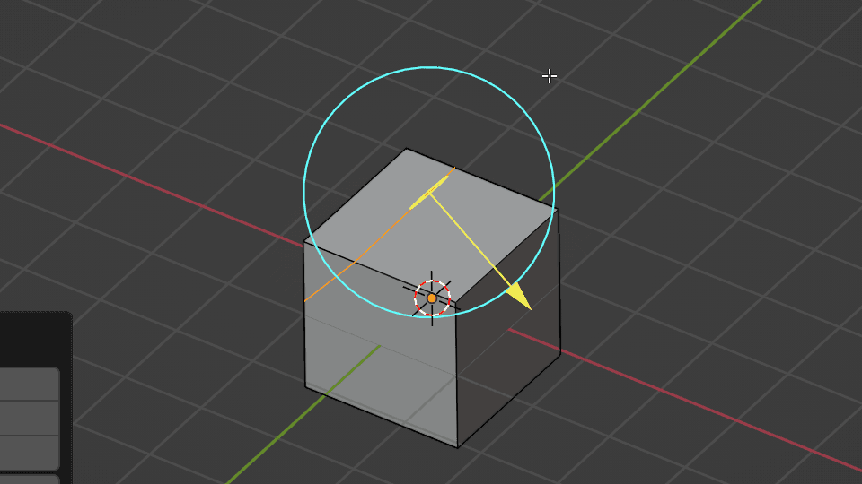

    引用: [【Blender】ナイフ・ナイフ投影の使い方](https://saru-blender.com/knife)

 
 

- #### 矢印を`左クリックでドラッグ`することで、切り込みの**位置**を変更することができる

    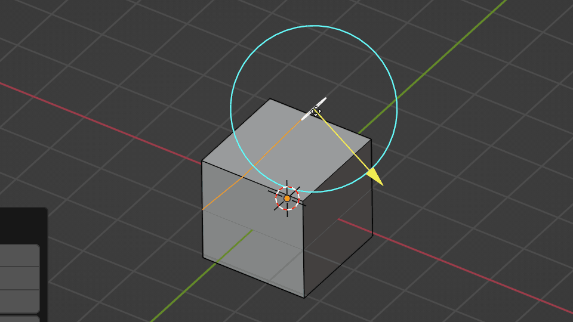

    引用: [【Blender】ナイフ・ナイフ投影の使い方](https://saru-blender.com/knife)

 
 

- #### 設定項目の`内側をクリア`にチェックを入れると**矢印の反対側が消える**

    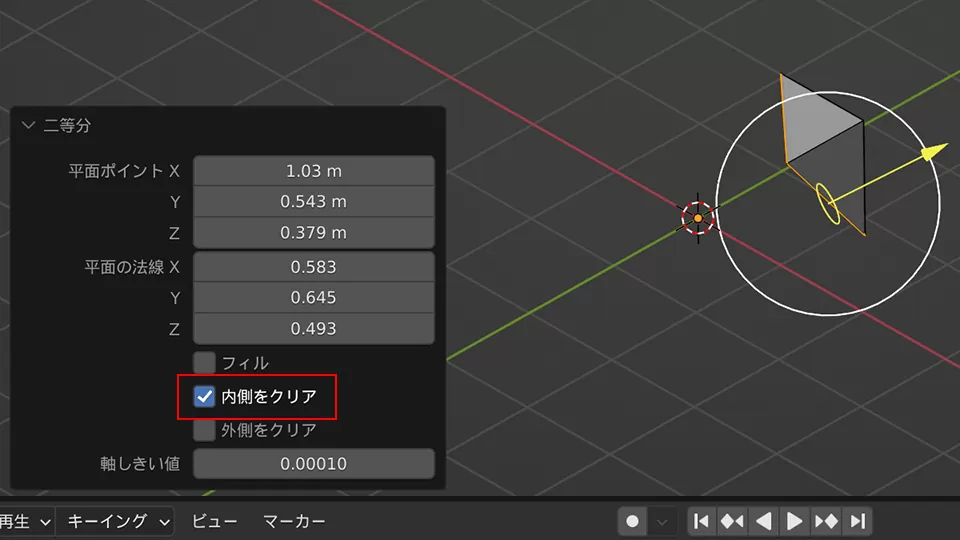

    引用: [【Blender】ナイフ・ナイフ投影の使い方](https://saru-blender.com/knife)

 
 

- #### 設定項目の`外側をクリア`にチェックを入れると**矢印の向いている側が消える**

    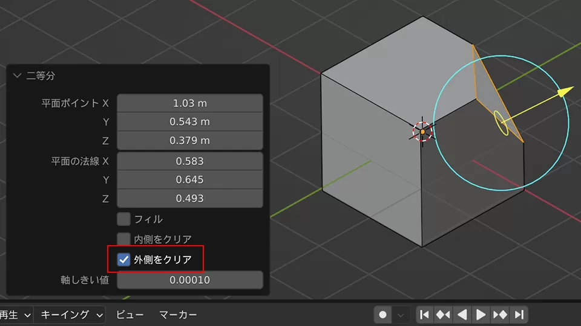

    引用: [【Blender】ナイフ・ナイフ投影の使い方](https://saru-blender.com/knife)

 
 

- #### 設定項目の`フィル`にチェックを入れると**切り取った箇所に面を張る**

    

    引用: [【Blender】ナイフ・ナイフ投影の使い方](https://saru-blender.com/knife)

---

### ナイフ投影

- 切り込み対象のオブジェクトに、**他のオブジェクトを投影した形の切り込みを入れる**ことのできる機能

    - ★視点の位置から投影されることに注意

    

 
 

#### ナイフ投影の方法

1. 切り込みを入れたいオブジェクトを選択して Edit Mode に入る

 

2. 視点を調整し、投影したいオブジェクトを `Outliner` ビューにて選択する

 

3. 3D Viewport の上部にある `メッシュ (Mesh)` から `ナイフ投影 (Knife Project)` を選択する

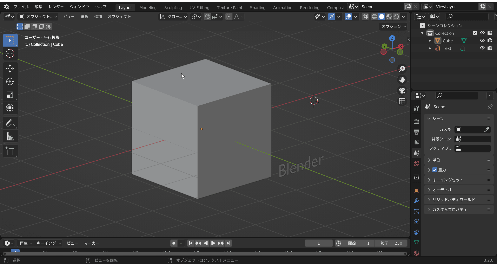

引用: [【Blender】ナイフ・ナイフ投影の使い方](https://saru-blender.com/knife)

 

- #### Cut Through オプションにチェックを入れると、貫通してナイフ投影をすることができる

    - Cut Throught なし

        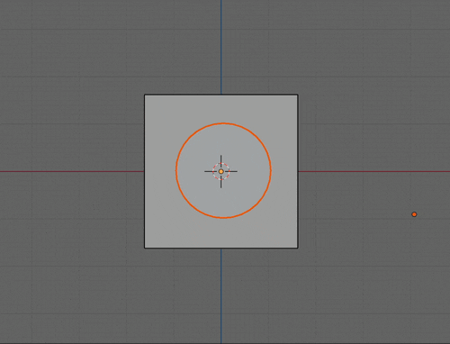

     

     - Cut Throught あり

        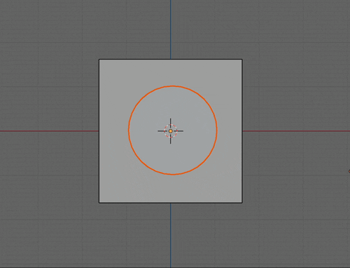