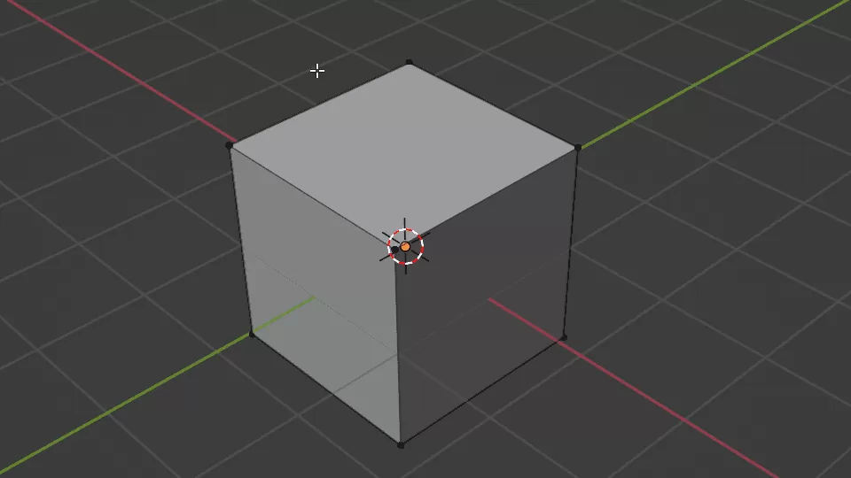
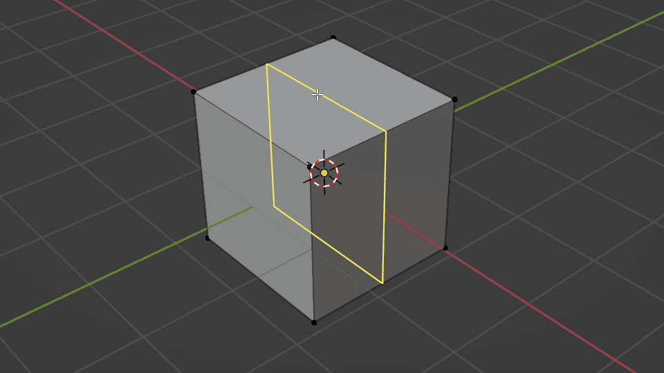
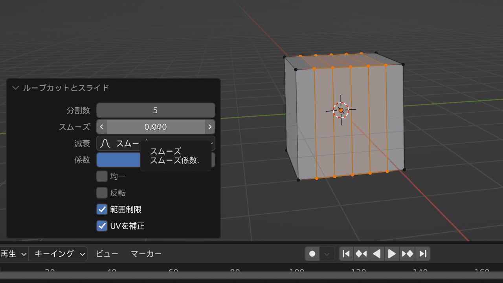
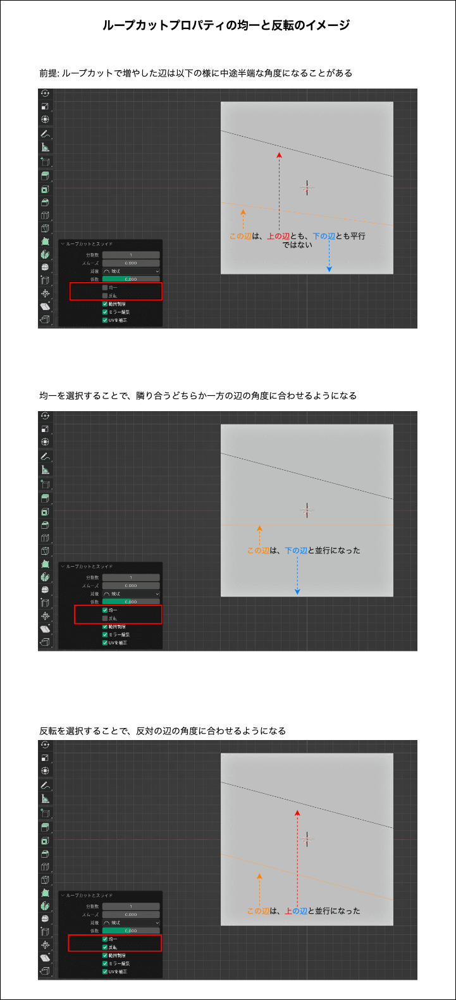
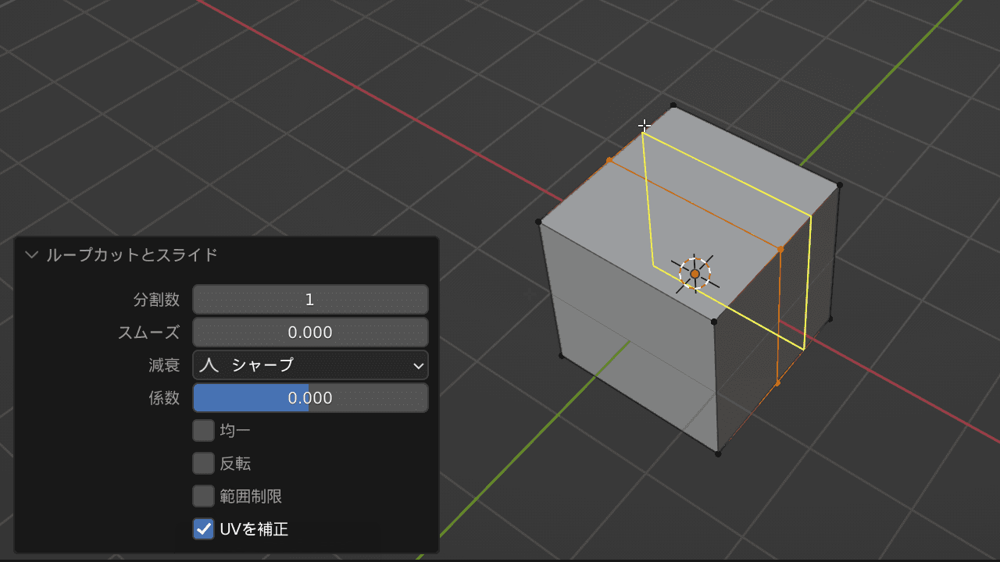
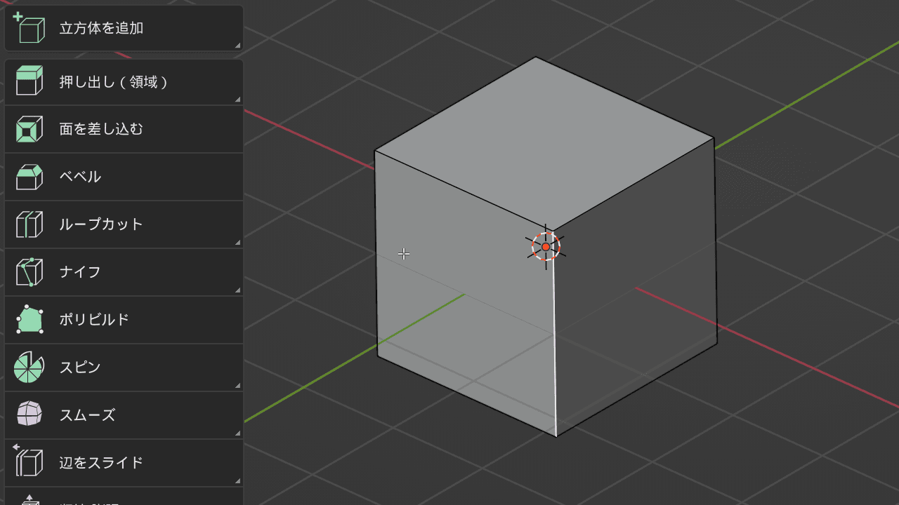
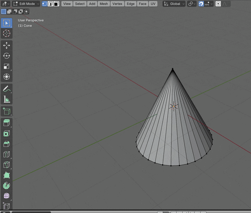
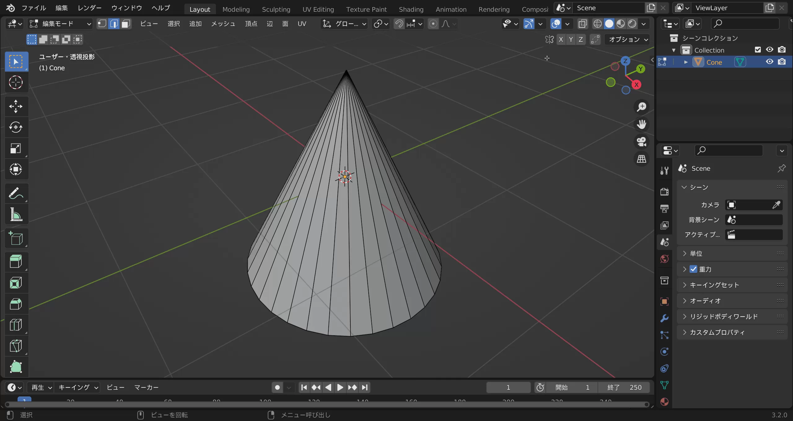
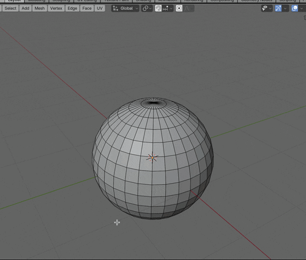

### ループカット (Loop Cut)

- オブジェクトを輪切りにするように辺を追加することができる機能

 

- `ctrl` + `r` でループカット ON

    

    引用: [【Blender】ループカットの使い方](https://saru-blender.com/loopcut)

 

- ループカット中 (黄色の線が表示されている時) にマウスホイール操作でカット数を変更できる

    

    引用: [【Blender】ループカットの使い方](https://saru-blender.com/loopcut)

---

### ループカット系プロパティ

- #### スムース / 減衰 (smoothness / fallout)

    - ループカットで増やした辺の形状を変更する項目

    - スムース (smoothness) は強度を意味する

        - 値が大きくなればなるほどループカット辺は大きくなる

        - 値が小さくなればなるほどループカット辺は小さくなる

    - 減衰 (fallout) は形状を意味する

    

    引用: [【Blender】ループカットの使い方](https://saru-blender.com/loopcut)

 

- #### 均一 / 反転 (Even / Flipped)

    - ループカットで増やした辺の角度を変更するプロパティ
    
    - 均一 (Even) はループカット辺を隣り合うどちらか一方の辺の角度に合わせるプロパティ

    - 反転 (Flipped) は均一とは逆の辺の角度にループカット辺を合わせるプロパティ

    

    引用: [ループカットの使い方を超シンプルに分かりやすく解説！](https://makit-real.com/loop-cut/#ループカットのプロパティー)

 

- #### 範囲制限 (clamp)

    - オブジェクトの範囲内でループカットする制限を取り払うプロパティ

    

    引用: [【Blender】ループカットの使い方](https://saru-blender.com/loopcut)

 
 

参考サイト

[ループカットの使い方を超シンプルに分かりやすく解説！](https://makit-real.com/loop-cut/#ループカットのプロパティー)

---

### オフセット辺ループカット

- 選択した辺から等距離に左右にループカットを入れる機能

    - ★★★ Edit Mode で辺を選択していないと使えない機能

- `shift` + `ctrl`+ `r` でオフセットループカット ON

    

    引用: [【Blender】ループカットの使い方](https://saru-blender.com/loopcut)

---

### ループカットが入らないオブジェクト

- 意図した通りにループカットが入らないメッシュが存在する (cone など)

    - したの gif は横に一周する辺をループカットで増やしたいのにできない例

    

 

- #### ループカットが入らないオブジェクトでもループカットを入れる方法

    - subdivide (細分化) でループカットと同様に辺を増やすことができる

    

    引用: [【Blender】ループカットの使い方](https://saru-blender.com/loopcut)

---

### 特定のポリゴンにのみループカットを入れたい

- #### 間違った方法

    - Edit Mode にてループカットを入れたい面を選択してループカット

    

 

- #### 正しい方法

    - Edit Mode でループカットを入れたい面を選択し、それ以外を[ハイド](./Select.md)し、ループカットを実行

    

    引用: [【Blender】ループカットの使い方](https://saru-blender.com/loopcut)