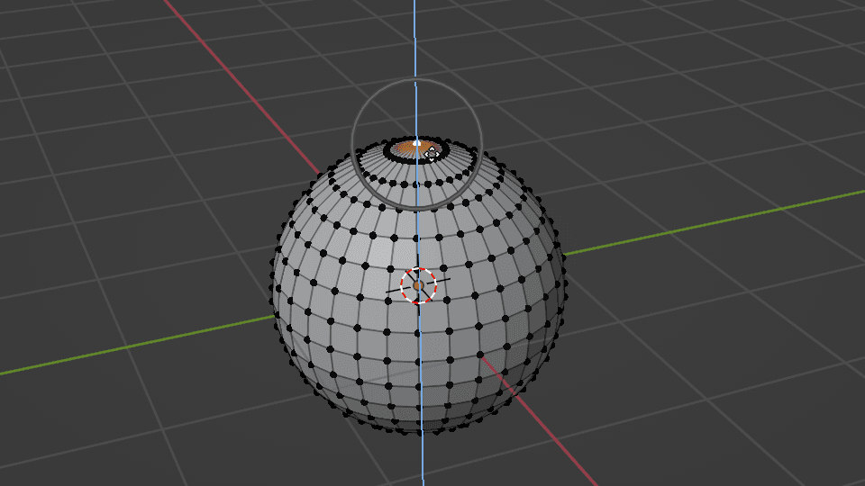
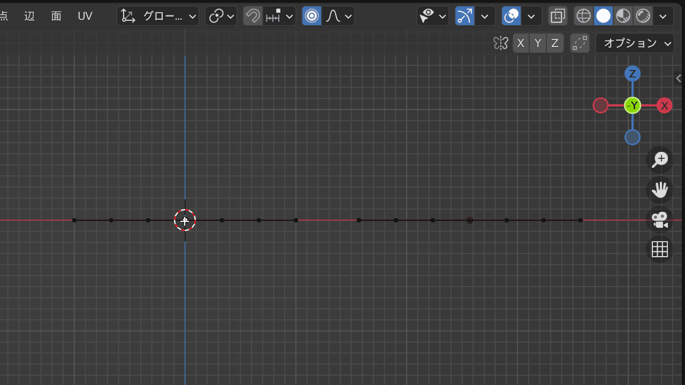

### プロポーショナル編集

- 選択した箇所の周辺も追従させてオブジェクトの編集ができる機能　

    

    引用: [【Blender】プロポーショナル編集の使い方](https://saru-blender.com/proportional)

 

- Edit Mode 時に `o` でプロポーショナル編集を有効・無効に切り替えることができる

 

- `shift` + `o` でプロポーショナル編集のタイプを選ぶことができる

 

- ★★★プロポーショナル編集中に `x`, `y`, `z` を押すと、その軸に固定して編集することができる

 
 

参考サイト

[【Blender】プロポーショナル編集の使い方](https://saru-blender.com/proportional)

---

### ポイント

- プロポーショナル編集に表示される円は編集の影響範囲を表す
    
    - マウスホイールで円を小さく/大きくすることができる

    

    引用: [【Blender】プロポーショナル編集の使い方](https://saru-blender.com/proportional)

---

### 接続 と ビューから投影

- プロポーショナル編集には以下の2つの設定がある

 

- #### 接続 (Connected Only)

    - 選択した箇所がつながっている部分のみ編集の影響対象となる

    

    引用: [【Blender】プロポーショナル編集の使い方](https://saru-blender.com/proportional)

 

- #### ビューから投影 (Projected from View)

    - 編集の影響対象がビュー (視点) から投影されたものになる

    

    引用: [【Blender】プロポーショナル編集の使い方](https://saru-blender.com/proportional)

     

    

---

### プロポーショナル編集とハイドの組み合わせ

- 選択範囲以外をハイドにしてプロポーショナル編集した場合、**ハイドされた部分はプロポーショナル編集の影響を受けない**

    