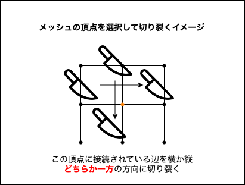
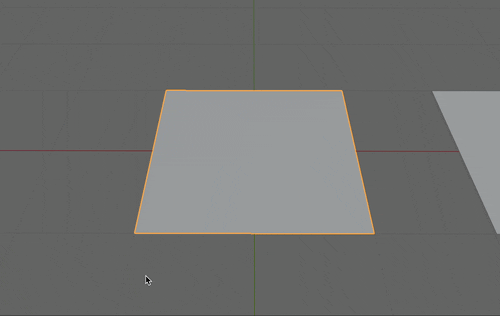
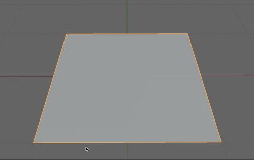
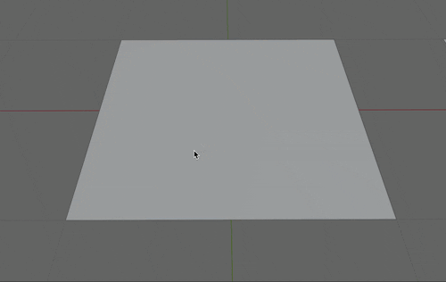

### 切り裂き (Rip)

- [分割 (Split)](./Split&Separate.md#分割-split-1)に似た機能

- 選択した頂点,辺をもとにメッシュを切り裂く機能

- ★面選択では利用できない

 

- #### 頂点を選択して切り裂く

    

     

    - 切り裂く方向はマウスカーソルの位置によって決まる

        - 詳しくは[こちら](https://matatabi-ux.hateblo.jp/entry/2019/08/29/100000)を参照

    

 
 

- #### 辺を選択して切り裂く

    

     

    

 
 

- #### 切り裂きと同時に穴埋めする

    - ★`option (⌥)` + `v` で切り裂きと切り裂いた面を埋めるのを同時に行う

    - \*以下の gif では最初のメッシュは普通の切り裂き、2つ目にメッシュには切り裂きと同時に穴埋めを行っている

        

 
 

参考サイト

[切り裂き](https://blender3d.biz/knowledge_modeling_editing_rip.html)

[【Blender】分割・分離・切り裂き・複製](https://saru-blender.com/separate)

[Blender 2.8 で平面を切り裂く](https://matatabi-ux.hateblo.jp/entry/2019/08/29/100000)