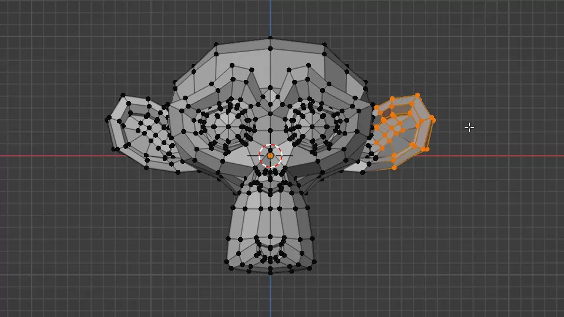

### 編集モードでの頂点、辺、面の選択方法

- #### 最短パス選択 (Pick Shortest Path)

    - 選択した2点の最短経路に沿ってそのほかの点も選択する方法

    - 1点を選択した後、`ctrl` + `右クリック` でもう一点を選択

    - ★辺、面も同じ

    

    引用: [【Blender】いろいろな選択方法](https://saru-blender.com/selecting)

 
 

- #### 全選択 (All)

    - 全ての点 (辺/面) を選択する

    - `a` で全選択、解除を切り替えることができる

    

    引用: [【Blender】いろいろな選択方法](https://saru-blender.com/selecting)
 
 

- #### 辺ループ (Edge Loop)

    - メッシュを一周して点、辺を選択する方法

    - ★選択した辺の**方向に沿って**他の点、辺が選択される

    - 辺の上にマウスカーソルを乗せて `option (⌥)` + `左クリック`

    - ★セレクトモードが面の場合は辺ループも辺リングも同じになる

    

    引用: [【Blender】いろいろな選択方法](https://saru-blender.com/selecting)
 
 

- #### 辺リング (Edge Ring)

    - メッシュを一周して点、辺を選択する方法

    - ★選択した辺とは**垂直の方向**に他の点、辺が選択される

    - 辺の上にマウスカーソルを乗せて `ctrl` + `option (⌥)` + `左クリック`

    - ★セレクトモードが面の場合は辺ループも辺リングも同じになる

    

    引用: [【Blender】いろいろな選択方法](https://saru-blender.com/selecting)

 
 

- #### サークル選択 (Circle Select)

    - なぞった箇所を選択する方法

    - `c` + `左クリックしたままドラッグ`

    - ★`右クリック` でサークル選択状態を解除

    

    引用: [【Blender】いろいろな選択方法](https://saru-blender.com/selecting)

     

    - ★★`shit` + サークル選択で、選択箇所を解除することができる

    

    引用: [【Blender】いろいろな選択方法](https://saru-blender.com/selecting)
    
 
 

- #### 反転 (Invert)

    - 選択した範囲を反転する

    - 選択後に `ctrl` + `i` で反転選択

    

    引用: [【Blender】いろいろな選択方法](https://saru-blender.com/selecting)

 
 

- #### リンク選択 (Linked)

    - 選択した箇所からひとつなぎに範囲を選択

    - 選択後に `ctrl` + `l`

    

    引用: [【Blender】いろいろな選択方法](https://saru-blender.com/selecting)

 
 

- #### ミラー選択 (Mirror)

    - 選択した範囲と対称となる範囲を選択する

    - `ctrl` + `shift` + `m` でミラー選択

    

    引用: [【Blender】いろいろな選択方法](https://saru-blender.com/selecting)

     

    - ★ミラー選択を実行すると、エリアの左下に対称軸の設定が表示される

        - ★`shift` + `対称軸の選択` で複数の対称軸を設定することも可能

    
    
 
 

- #### 類似選択

    - 選択した範囲と類似した箇所を自動で選択してくれる機能

    - 選択後に `shift` + `m` で類似箇所を自動で選択

    

    引用: [【Blender】いろいろな選択方法](https://saru-blender.com/selecting)

 
 

参考サイト

[【Blender】いろいろな選択方法](https://saru-blender.com/selecting)