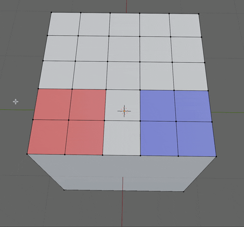
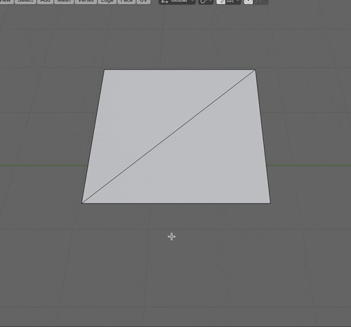
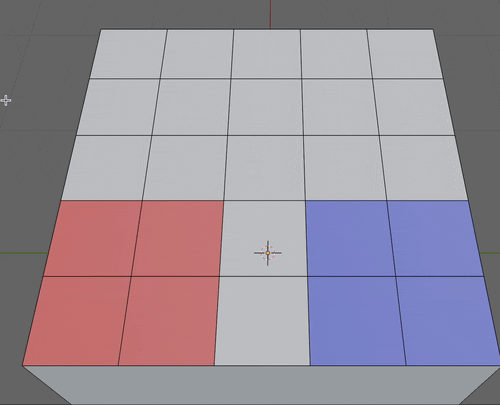
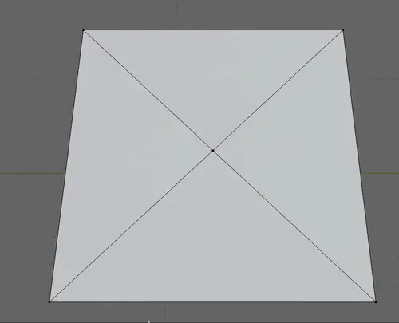
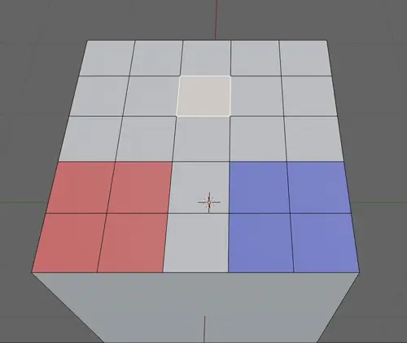
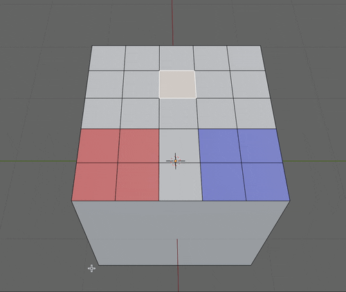
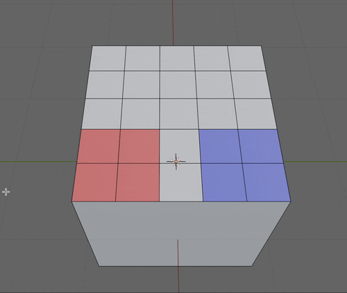

### 分割 (Split) と分離 (Separate)

#### 分割 (Split)

- **メッシュの一部を別のメッシュ**として切り分ける機能

- 分割 (Split) で切り分けたものは**元のオブジェクトの一部として扱われる**

 

#### 分離 (Separate)

- 分離 (Separate)は**メッシュの一部を別のオブジェクトとして切り分ける**機能　

- 分離 (Separate) で切り分けたものは**元のオブジェクトとは別のオブジェクトとして扱われる**

---

### 分割 (Split)

- ★Edit Mode で分割対象を選択し、`option (⌥)` + `m` で分離メニューが表示される

    

 

- 分割には以下の種類がある

    - 選択 (Selection)

    - 面(選択辺で) (Faces by Edges)

    - 辺と面(選択頂点で) (Faces & Edges by Vertices)

 
 

- #### 選択分割 (Selection)

    - 選択した部分 (頂点/辺/面)を別のメッシュとして切り分ける方法

         

    - ★頂点/辺を選択して選択分割をした場合は、コピーができるイメージ (分割後は `g` で Translate)

        

         

    - ★面を選択して選択分割をした場合は、その面を切り分けるイメージ (分割後は `g` で Translate)

        

 
 

- #### 面(選択辺で) (Faces by Edges)

    - 選択した辺をもとに面を分割する方法

    - ★選択した辺にハサミを入れるイメージ

        

         

        

 
 

- #### 辺と面(選択頂点で) (Faces & Edges by Vertices)

    - 選択した頂点をもとに辺と面を分割する方法

    - ★選択した頂点に接続している全ての辺にハサミを入れるイメージ

        

     

    - 面を選択すると、**その面の頂点に接続している全ての辺**にハサミを入れるイメージ

        

---

### 分離 (Separate)

- ★Edit Mode で分離対象を選択し、`p` で分離メニューが表示される

    

 

- ★分離直後は分離したオブジェクトを編集できない

    - 1度 Object Mode に戻って、分離したオブジェクトを選択してから再度 Edit Mode に切り替えることによって分離したオブジェクトの編集が可能

        

 

- 分離には以下の種類がある

    - 選択 (Selection)

    - マテリアルで (By Material)

    - 構造的に分離したパーツで (By Loose Parts)

 
 

- #### 選択分離 (Selection)

    - 選択した範囲を別のオブジェクトとして分離する方法

    - ★頂点/辺を選択して選択分離をした場合は、コピーができるイメージ

        

         
    
    - ★面を選択して選択分離をした場合は、その面を切り分けるイメージ

        

 
 

- #### マテリアルで分離 (By Material)

    - マテリアル毎に分離する方法

    - ★[Select](#選択分離-selection)とは異なり、分離対象を選択する必要はない (言うなれば Edit Mode の対象全てが対象)

        
    
 
 

- #### 構造的に分離したパーツで分離 (By Loose Parts)

    - 頂点・辺・面がつながっていない（離れている）メッシュごとに分離する

        